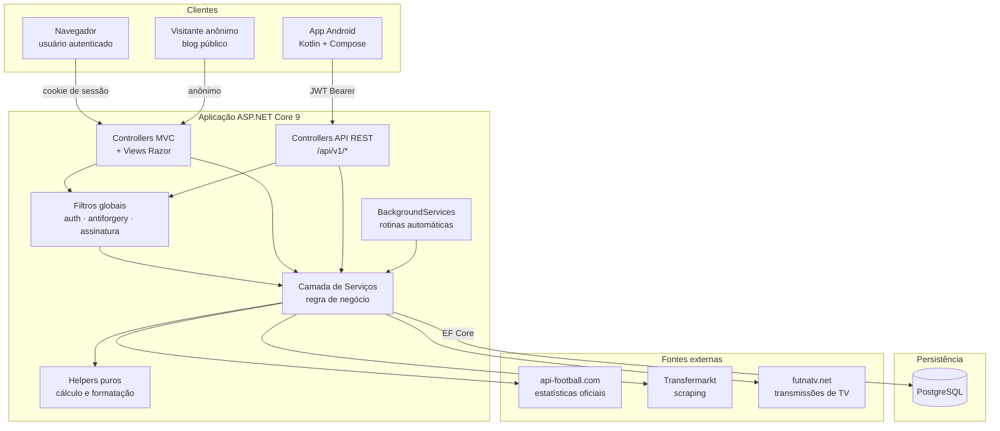
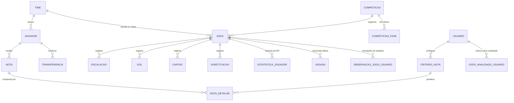

# Documentação Técnica — Plataforma Comentarista / Análise de Craque

> Documento de arquitetura e engenharia. Descreve o que o sistema faz, como está
> construído, quais decisões técnicas o sustentam e em que estado de maturidade se
> encontra. Escrito para leitor com formação técnica.

**Produto em produção:** `analisedecraque.cloud`
**Data desta revisão:** 07/08/2026

---

## Sumário

1. [Visão geral](#1-visão-geral)
2. [Arquitetura](#2-arquitetura)
3. [Stack tecnológico](#3-stack-tecnológico)
4. [Modelo de domínio](#4-modelo-de-domínio)
5. [Módulos funcionais](#5-módulos-funcionais)
6. [Padrões de engenharia](#6-padrões-de-engenharia)
7. [API REST e aplicativo Android](#7-api-rest-e-aplicativo-android)
8. [Integrações externas e automações](#8-integrações-externas-e-automações)
9. [Segurança](#9-segurança)
10. [Persistência e evolução do schema](#10-persistência-e-evolução-do-schema)
11. [Qualidade e testes](#11-qualidade-e-testes)
12. [Infraestrutura, deploy e operação](#12-infraestrutura-deploy-e-operação)
13. [Controle de acesso e monetização](#13-controle-de-acesso-e-monetização)
14. [Métricas do código](#14-métricas-do-código)
15. [Dívida técnica reconhecida e roadmap](#15-dívida-técnica-reconhecida-e-roadmap)

---

## 1. Visão geral

### O problema

Analisar futebol com rigor é hoje um trabalho manual e disperso. Comentaristas,
analistas de desempenho, scouts e jornalistas esportivos acompanham partidas anotando
em papel, planilhas e blocos de notas soltos. O resultado é um acervo que não se
acumula: o que foi observado num jogo não conversa com o que foi observado em outros
vinte, e nenhuma conclusão agregada emerge daí.

### O que o sistema faz

A plataforma transforma a observação de partidas em **base de dados estruturada e
consultável**. O usuário registra o que viu — escalações, eventos, movimentações
táticas, observações em texto, notas por critério — e o sistema converte isso em
estatísticas, rankings, relatórios comparativos e histórico de jogadores e times.

Três características definem o produto:

**Observação estruturada.** A tela de análise de jogo não é um campo de texto livre.
É um ambiente com prancheta tática, marcação de escalação por arrasto, cronômetro de
partida, registro de eventos (gols, cartões, substituições, pênaltis) e sistema de
tags com menção a jogadores. Cada elemento vira registro relacional.

**Dados objetivos integrados aos subjetivos.** O sistema importa estatísticas oficiais
via API externa (finalizações, desarmes, duelos, passes-chave, dribles — 22 métricas
mapeadas) e as combina com a avaliação do analista. A nota final de um jogador é
calculada por um motor de critérios com pesos configuráveis pelo próprio usuário.

**Acervo que compõe.** Como tudo é relacional, o décimo jogo analisado enriquece a
leitura dos nove anteriores. Relatórios cruzam competições, temporadas, times e
jogadores; o perfil de um jogador agrega tudo que já foi registrado sobre ele.

### Quem usa

Usuários autenticados individualmente, com dados segregados por conta: as análises,
notas, critérios e observações de cada usuário são privados. Há um app Android
complementar para uso durante a partida — a tela de TV e o tablet na mão.

---

## 2. Arquitetura

O sistema é um **monólito modular** em ASP.NET Core, servindo três superfícies a
partir de uma única base de código e um único banco:

### Por que monólito

A decisão é deliberada, não acidental. O domínio é altamente relacional — jogo,
jogador, time, competição, escalação e evento se cruzam em quase toda consulta.
Fragmentar isso em serviços significaria substituir *joins* por chamadas de rede e
transações locais por consistência eventual, sem ganho correspondente. O sistema é
operado por uma equipe pequena; um artefato único de deploy e um banco único mantêm o
custo operacional baixo e o tempo de diagnóstico curto.

A modularidade que interessa foi obtida **dentro** do monólito: serviços de domínio
isolados, helpers puros e sem dependência de infraestrutura, e uma camada de API que
compartilha a regra de negócio com a web em vez de duplicá-la.

### Fluxo de uma requisição

1. **Kestrel** recebe a requisição atrás de proxy reverso nginx (TLS terminado no nginx,
   repassado via cabeçalhos `X-Forwarded-*`).
2. **Middleware de segurança** aplica cabeçalhos (CSP, HSTS, `X-Content-Type-Options`,
   `Referrer-Policy`, `Permissions-Policy`) a toda resposta, inclusive estáticos.
3. **Autenticação** resolve o cookie de sessão (web) ou o token JWT (API).
4. **Filtros globais** verificam autorização, token antiforgery, situação de pagamento
   e registram atividade do usuário.
5. **Controller** valida a entrada, delega ao **serviço** de domínio.
6. **Serviço** consulta o banco via EF Core, aplica regra, chama **helpers** puros para
   cálculo.
7. Retorno como **view Razor** (HTML renderizado no servidor) ou **JSON** (API).

---

## 3. Stack tecnológico

### Backend

| Componente | Tecnologia | Papel |
|---|---|---|
| Runtime | .NET 9 / C# 13 | Plataforma de execução |
| Framework web | ASP.NET Core MVC | Roteamento, model binding, pipeline |
| ORM | Entity Framework Core 9 | Mapeamento objeto-relacional, migrações |
| Banco | PostgreSQL (via Npgsql) | Persistência transacional |
| Identidade | ASP.NET Core Identity | Usuários, senhas, papéis, tokens |
| Autenticação API | JWT Bearer | Sessão do app Android |
| Servidor HTTP | Kestrel + nginx | Aplicação + proxy reverso e TLS |

### Frontend web

| Componente | Tecnologia |
|---|---|
| Renderização | Razor (`.cshtml`) — server-side rendering |
| Estilo | CSS próprio + Bootstrap |
| Interatividade | JavaScript sem framework (vanilla) |
| Gráficos | Chart.js |
| Validação | jQuery Validation Unobtrusive (integrada às DataAnnotations do modelo) |

Não há etapa de build de front-end — sem Node, sem bundler, sem `package.json`. Uma
alteração de tela é um arquivo salvo e a página recarregada. Para um sistema com esse
perfil (muita listagem, formulário e relatório) essa escolha elimina toda uma classe de
complexidade operacional sem custo funcional. As poucas telas de estado realmente vivo
— prancheta tática, escalação por arrasto — são atendidas por módulos JavaScript
dedicados.

### Aplicativo Android

| Componente | Tecnologia |
|---|---|
| Linguagem | Kotlin |
| UI | Jetpack Compose + Material 3 |
| Arquitetura | MVVM (ViewModel + State) |
| Injeção de dependência | Hilt / Dagger |
| HTTP | Retrofit + OkHttp, serialização Kotlinx |
| Persistência local | DataStore (sessão e token) |
| SDK | mín. 26 · alvo 35 · JVM 17 |

### Bibliotecas de apoio

`Markdig` (Markdown do blog) · `HtmlSanitizer` (sanitização do HTML gerado) ·
`HtmlAgilityPack` (parsing de páginas em scraping) · `QRCoder` (QR code de pagamento
PIX).

---

## 4. Modelo de domínio

O núcleo relacional gira em torno de cinco entidades, das quais tudo mais deriva:

São **43 entidades mapeadas** (mais as tabelas do ASP.NET Core Identity), cobrindo:

- **Núcleo esportivo** — times, jogadores, jogos, competições, fases, classificação,
  treinadores e histórico de treinadores, nacionalidades, transferências.
- **Eventos de partida** — gols, assistências, cartões, substituições, pênaltis
  perdidos e disputas de pênaltis, cronômetro.
- **Tática** — formações, posições de formação, escalações, setas de movimentação,
  jogadas da prancheta, fases táticas, escalação padrão do time.
- **Avaliação** — notas, detalhes de nota, critérios configuráveis, estatísticas por
  jogador e por jogo.
- **Camada por usuário** — jogos analisados, observações, tags de observação com
  menções a jogadores, anotações de time, simulações, seleções de Copa, critérios
  próprios, competições prioritárias.
- **Conteúdo e negócio** — posts de blog com categorias e tags, pagamentos por usuário,
  logs de sincronização externa.

Um traço de projeto relevante: entidades como `Nota`, `CriterioNota`,
`ObservacaoJogoUsuario` e `JogoAnalisadoUsuario` carregam `UsuarioId`. O mesmo jogo
pode ser analisado por vários usuários com leituras diferentes, e cada um enxerga
apenas a sua — o dado esportivo objetivo é compartilhado, a interpretação é privada.

---

## 5. Módulos funcionais

### 5.1 Análise de jogo — o núcleo do produto

A tela `Jogos/Analisar` é o ambiente principal de trabalho. Concentra, numa única
página, tudo que o analista precisa durante e após a partida: escalação das duas
equipes com formação, marcação de eventos, cronômetro, prancheta tática, campo de
observações com menção a jogadores, notas por critério e importação de estatísticas.

Do ponto de vista de engenharia é o componente mais denso do sistema: a view soma
~1.500 linhas e é apoiada por ~2.700 linhas de JavaScript dedicado, mais módulos
separados para arrasto de escalação, canvas do campo e prancheta.

### 5.2 Prancheta de jogadas

Editor gráfico sobre um campo de futebol renderizado em canvas: posicionamento de
jogadores, setas de movimentação, sequências de jogada. As jogadas são persistidas e
recuperáveis, associadas ao jogo. É o módulo com maior densidade de código
cliente (~1.900 linhas de JavaScript).

### 5.3 Motor de notas

Sistema de pontuação híbrido. Parte de uma **nota base fixa (4,0)** e aplica pesos
sobre 22 ações mapeadas às estatísticas importadas — gol, assistência, finalização no
gol, desarme, interceptação, duelo vencido, drible certo, falta cometida, cartão,
pênalti sofrido/cometido/defendido, entre outras. Aplica ainda modificadores de
contexto: bônus por vitória, penalidade por derrota, bônus para goleiro sem sofrer gol,
e piso mínimo.

O ponto de arquitetura importante: **os pesos vivem no banco** (`CriterioNota`,
por usuário), não no código. O helper mantém apenas o mapeamento de ação → propriedade
da estatística. Isso permite que cada analista calibre seu próprio modelo de avaliação
sem alteração de software — a regra é dado, não código.

### 5.4 Relatórios

Motor de agregação que cruza jogos, jogadores, times, competições e temporadas,
produzindo rankings individuais e coletivos, médias, totais e comparativos diretos
entre times (*match up*). Aceita filtros por competição, time, temporada, mínimo de
jogos e escopo (apenas jogos analisados pelo usuário ou toda a base).

Foi extraído do controller para um serviço próprio justamente para ser reaproveitado
pela API mobile sem duplicar regra de negócio. O serviço expõe parâmetros que permitem
ao cliente móvel desligar blocos caros de agregação que não exibe — otimização
consciente de custo de consulta por superfície.

### 5.5 Competições

Suporte a estruturas de competição distintas: pontos corridos (Brasileirão), mata-mata
com chaveamento (Copa do Brasil), fase de grupos seguida de eliminatórias (Libertadores,
Sul-Americana, Champions League, Copa do Mundo). Inclui construtores de chaveamento em
árvore, calculadora de classificação e classificador automático de fase de jogo.

### 5.6 Simulador de tabela

Permite projetar resultados de rodadas futuras e observar o efeito na classificação —
simulações persistidas por usuário.

### 5.7 Perfil de jogador e transferências

Consolidação por jogador: estatísticas agregadas, notas históricas, jogos disputados,
histórico de transferências e situação de aposentadoria.

### 5.8 Blog público

Módulo de conteúdo com posts em Markdown, categorias, tags e URLs por *slug*. É a única
área anônima do sistema — serve à aquisição orgânica de usuários. O Markdown é
convertido para HTML **no momento de salvar**, não a cada requisição: a view pública
apenas imprime HTML já pronto e já sanitizado, o que elimina custo de renderização por
acesso e reduz a superfície de XSS.

### 5.9 Painel administrativo

Gestão de usuários, monitoramento dos serviços automáticos (estado, último ciclo,
resultado), acompanhamento de usuários online, logs de sincronização externa e controle
de pagamentos.

---

## 6. Padrões de engenharia

### Separação de responsabilidades

O código segue uma divisão consistente em quatro camadas:

- **Controllers** — recebem a requisição, validam entrada, delegam. Não contêm regra de
  negócio de peso.
- **Services** (21) — regra de negócio, orquestração e acesso a dados. Injetados por
  construtor via o contêiner de DI do ASP.NET Core.
- **Helpers** (28) — funções puras de cálculo, formatação e transformação. Sem estado,
  sem dependência de infraestrutura — e, por isso, a superfície naturalmente testável do
  sistema.
- **ViewModels** (30) — contratos explícitos entre controller e view. Nenhuma entidade
  de persistência é exposta diretamente à camada de apresentação.

### Filtros globais em vez de repetição

Preocupações transversais são aplicadas uma vez, no *pipeline*, e não repetidas em cada
controller:

| Filtro | Efeito |
|---|---|
| `AuthorizeFilter` | Todo controller exige autenticação **por padrão**; o acesso anônimo é exceção explícita (`[AllowAnonymous]`) |
| `AutoValidateAntiforgeryToken` | Todo `POST/PUT/DELETE/PATCH` valida token antiforgery |
| `AtividadeUsuarioFilter` | Registra último acesso (painel de usuários online) |
| `AssinaturaFilter` | Bloqueia usuário inadimplente — redireciona na web, retorna 403 na API |

A escolha de tornar autenticação e proteção CSRF o **padrão** — em vez de algo a ser
lembrado a cada novo controller — é uma decisão de segurança por construção: o
esquecimento leva ao estado seguro, não ao inseguro.

### Autorização baseada em política

Além do papel de administrador, há políticas específicas com *requirements* e *handlers*
próprios (ex.: `BlogEscrever`, satisfeita por administrador **ou** por usuário com a
permissão de autor). Permite conceder capacidade granular sem inflar o conceito de
administrador.

### Detalhes de robustez

Alguns pontos que revelam maturidade operacional acumulada:

- **Model binder de número flexível** — aceita `10,5` e `10.5` indistintamente,
  independentemente da cultura configurada no servidor. Elimina uma classe inteira de
  bug de entrada de dados em ambiente com vírgula decimal.
- **Validador de e-mail opcional** — permite cadastro sem e-mail mantendo validação de
  formato e unicidade quando informado, contornando limitação do validador padrão do
  Identity.
- **Cache de imagens em memória** com limite de 128 MB, dimensionado por bytes da
  imagem, servindo escudos e fotos por meio de um proxy próprio.
- **Consultas de leitura com `AsNoTracking`** — e `AsNoTrackingWithIdentityResolution`
  onde a deduplicação de entidades repetidas em *includes* importa mais que o custo do
  rastreamento.

---

## 7. API REST e aplicativo Android

### A API

Superfície REST versionada sob `/api/v1`, com nove controllers: `auth`, `jogos`,
`jogadores`, `times`, `competicoes`, `relatorios`, `analises`, `anotacoes`.

Autenticação por **JWT Bearer**, coexistindo com o cookie de sessão da web — dois
esquemas de autenticação sobre o mesmo modelo de identidade e as mesmas políticas de
autorização. O app não tem base de usuários própria nem regra própria: consome os
mesmos serviços de domínio que a web.

Esse é o ponto estrutural que merece destaque para avaliação técnica: **a API não é um
sistema paralelo**. `RelatoriosService`, `PerfilJogadorService` e os demais são
compartilhados. Uma mudança em regra de avaliação de jogador é feita uma vez e vale nas
três superfícies. O risco clássico de divergência entre web e mobile foi removido por
construção.

### O aplicativo

Cliente Android nativo em Kotlin com Jetpack Compose, arquitetura MVVM e injeção de
dependência via Hilt. Organizado em camadas explícitas — `data/remote` (Retrofit e
DTOs), `data/repository`, `data/local` (sessão), `ui` (telas e ViewModels) — somando 60
arquivos-fonte, dos quais 35 de interface.

O caso de uso é o uso durante a partida: o analista assiste ao jogo e registra no
tablet, sem depender do computador.

---

## 8. Integrações externas e automações

### Fontes de dados

| Fonte | Método | Dados obtidos |
|---|---|---|
| **api-football.com** | API REST autenticada | Jogos, escalações, eventos e estatísticas oficiais por jogador |
| **Transfermarkt** | Scraping HTML (HtmlAgilityPack) | Calendário, placares, gols e detalhes de competições sul-americanas |
| **futnatv.net** | API pública | Plataforma de transmissão de TV de cada jogo do dia |

A vinculação com a fonte externa é feita por chave de correlação armazenada na própria
entidade (ex.: `apifoot:71:2026` identifica liga e temporada), o que permite reprocessar
e reconciliar sem acoplamento estrutural. O casamento de nomes de time entre fontes é
resolvido por um componente dedicado (`TimeNomeMatcher`) com dicionário de variações —
problema clássico e não trivial em integração esportiva.

### Rotinas automáticas

Executam como `BackgroundService` dentro do próprio processo:

- **Atualização de transmissões** (ciclo de 3 h) — busca o canal de cada jogo do dia. O
  ciclo curto é intencional: as emissoras confirmam grade ao longo do dia, não à
  meia-noite.
- **Complemento de dados de jogadores** (ciclo de 6 h) — preenche informações faltantes
  a partir das fontes externas.

Ambas registram estado em um **monitor de serviços** (`ServicoMonitor`) exposto no
painel administrativo: estado atual, último ciclo, resultado e possibilidade de pausa.
Rotina automática que roda sem observabilidade é passivo operacional; aqui há painel.

---

## 9. Segurança

O sistema aplica defesa em camadas, com decisões documentadas no próprio código.

### Autenticação e sessão

- Política de senha: mínimo 8 caracteres, com maiúscula, minúscula, dígito, caractere
  não alfanumérico e ao menos 4 caracteres distintos.
- Bloqueio de conta após 5 tentativas falhas, por 10 minutos.
- Cookie de sessão com `HttpOnly` (inacessível a JavaScript), `Secure` (apenas HTTPS),
  `SameSite=Lax` e prefixo **`__Host-`**, que amarra o cookie a host, HTTPS e path
  raiz — proteção contra fixação de cookie por subdomínio.
- Expiração de 7 dias com renovação deslizante.

### Proteção da aplicação

- **CSRF** — validação automática de token antiforgery em toda requisição mutante,
  incluindo chamadas AJAX via cabeçalho dedicado.
- **XSS** — Content-Security-Policy restritiva (`default-src 'self'`, `object-src
  'none'`, `frame-ancestors 'none'`), sanitização por *allowlist* de todo HTML gerado a
  partir de Markdown, e escape padrão do Razor.
- **Clickjacking** — `X-Frame-Options: DENY` e `frame-ancestors 'none'`.
- **Transporte** — HSTS em produção, redirecionamento HTTPS, TLS terminado no nginx.
- **Fingerprinting** — cabeçalho `Server` do Kestrel suprimido, `X-Powered-By` removido.
- **APIs do navegador** — câmera, microfone, geolocalização, pagamento e USB desligados
  por `Permissions-Policy`.
- **SQL injection** — eliminada por construção: todo acesso a dados passa por EF Core
  com consultas parametrizadas.

### Gestão de segredos

Chave JWT, senha do administrador inicial e credenciais de API ficam fora do código, em
*user secrets* (desenvolvimento) ou variáveis de ambiente (produção). A aplicação
**recusa iniciar em produção** sem chave JWT configurada. Se nenhuma senha de
administrador for fornecida no primeiro boot, o sistema gera uma senha forte
criptograficamente aleatória (20 caracteres, embaralhamento Fisher–Yates) e a registra
uma única vez em log — nunca há credencial padrão fixa no código.

### Isolamento de dados

Consultas de dados de usuário são filtradas por `UsuarioId` na camada de serviço.
Análises, notas, critérios e observações de um usuário não são acessíveis a outro.

---

## 10. Persistência e evolução do schema

O schema é versionado por **migrações do EF Core** — atualmente **112 migrações**
aplicadas. Cada alteração estrutural é um artefato versionado no repositório, revisável
e reversível, aplicado automaticamente na subida da aplicação.

O que isso significa em termos de risco: não há passo manual de banco no deploy, não há
divergência entre ambientes e o histórico completo de evolução do modelo é auditável no
Git. Sistemas que evoluem schema por script solto acumulam risco silencioso; este não.

Complementam a estratégia:

- **Seed idempotente** — dados de referência (competições, formações, nacionalidades)
  garantidos na inicialização.
- **Health check** de banco exposto em `/health`, usado pelo deploy e disponível a
  monitoramento externo.
- **Backup automático diário** — `pg_dump` em formato *custom* comprimido, retenção de
  14 dias, agendado por cron.

---

## 11. Qualidade e testes

Projeto de testes separado (`ControleFutebolWeb.Tests`) com **xUnit** e coleta de
cobertura por Coverlet.

**Estado atual: 65 testes, 100% aprovados** (execução verificada em 07/08/2026,
duração ~1 s).

A suíte cobre a lógica de maior densidade algorítmica e maior custo de erro: construtor
de chaveamento mata-mata, calculadora de classificação, normalização de fases,
normalização de nomes de jogador, geração de *slug*, renderização e sanitização de
Markdown, e validação de upload de imagem.

A escolha de concentrar os testes nos helpers puros é coerente com a arquitetura: são
componentes determinísticos, sem dependência de infraestrutura, onde o teste tem alto
valor por baixo custo de manutenção. É também, reconhecidamente, onde a cobertura se
encerra hoje — ver [seção 15](#15-dívida-técnica-reconhecida-e-roadmap).

---

## 12. Infraestrutura, deploy e operação

### Ambiente de produção

VPS Linux com:

- **nginx** como proxy reverso e terminação TLS;
- **systemd** gerenciando a aplicação como serviço (reinício automático em falha);
- **PostgreSQL** local com backup diário automatizado;
- domínio próprio com HTTPS.

### Pipeline de deploy

Script automatizado (`deploy.ps1`) com verificação em cada etapa:

1. **Limpeza** do diretório de publicação anterior — evita que binários obsoletos
   sobrevivam a um novo *publish*.
2. **Compilação** em modo Release, com **verificação explícita do código de saída** —
   falha de compilação aborta o deploy antes de qualquer envio.
3. **Envio** dos artefatos ao servidor por SCP.
4. **Reinício** do serviço via systemd.
5. **Verificação pós-deploy** — consulta o endpoint `/health` (que valida também a
   conexão com o banco) em até 12 tentativas ao longo de ~60 s. Sem resposta 200, o
   deploy é reportado como **falho**, com o comando de diagnóstico indicado.

Vale registrar o que há por trás disso: os passos 1 e 2 foram acrescentados após um
incidente real de produção em julho de 2026, em que um *publish* falho enviou binários
antigos ao servidor. O procedimento incorpora a lição — o roteiro de deploy é
documento vivo, não formalidade.

### Observabilidade

Logging estruturado, health check público, painel de monitoramento das rotinas
automáticas e logs de sincronização das integrações externas persistidos em banco.

---

## 13. Controle de acesso e monetização

O modelo de cobrança é **assinatura com controle de acesso por vigência**. Cada usuário
tem uma data de acesso pago (`AcessoPagoAte`); o `AssinaturaFilter`, aplicado
globalmente, verifica a vigência a cada requisição:

- vigente, administrador, ou sem cobrança definida → acesso normal;
- vencido → redirecionamento para tela de bloqueio na web, **403 com mensagem na API**.

O controller de conta fica deliberadamente fora do bloqueio, para que o usuário
inadimplente ainda consiga ver a situação, sair da conta e redefinir senha — bloqueio
que aprisiona o usuário gera suporte, não receita.

**Pagamento via PIX** implementado sem intermediário: o sistema gera o payload BR Code
no padrão EMV-MPM do Banco Central (com cálculo de CRC16-CCITT), que serve tanto ao
"copia e cola" quanto ao QR code renderizado. Não há dependência de PSP, gateway ou
taxa de intermediação — o recebimento é direto. A conciliação é feita hoje pelo painel
administrativo.

---

## 14. Métricas do código

Medições verificadas no repositório em 07/08/2026.

| Métrica | Valor |
|---|---|
| Código C# (exceto migrações) | ~31.900 linhas |
| Views Razor | ~28.100 linhas |
| JavaScript | ~5.800 linhas |
| Controllers web | 36 |
| Controllers de API | 9 |
| Serviços de domínio | 21 |
| Helpers | 28 |
| ViewModels | 30 |
| Views | 88 |
| Entidades mapeadas | 43 (+ tabelas do Identity) |
| Migrações de banco | 112 |
| Testes automatizados | 65 (100% aprovados) |
| Arquivos-fonte Android (Kotlin) | 60, sendo 35 de UI |

Total aproximado: **66 mil linhas** de código de aplicação, mais o cliente Android.

---

## 15. Dívida técnica reconhecida e roadmap

Documentar apenas o que funciona produz um retrato incompleto. Segue a avaliação franca
dos pontos abertos e do plano para cada um.

### Cobertura de testes concentrada nos helpers

**Situação.** Os 65 testes cobrem lógica pura; não há testes de integração cobrindo
controllers, serviços com acesso a banco ou os contratos da API.
**Risco.** Regressão em regra de negócio de serviço não é detectada automaticamente.
**Plano.** Testes de integração sobre os serviços de maior valor (`RelatoriosService`,
motor de notas) usando banco em contêiner, e testes de contrato da API para proteger o
app Android contra quebra silenciosa.

### CSP com `unsafe-inline`

**Situação.** A política de segurança de conteúdo ainda permite script e estilo inline,
porque o layout usa `<script>`, `<style>` e `onclick` inline.
**Risco.** Reduz a eficácia da CSP contra XSS — mitigado pelas demais camadas (escape do
Razor, sanitização por allowlist, cookie `HttpOnly`).
**Plano.** Migração para *nonces* por requisição e remoção do `unsafe-inline` de
`script-src`. O caminho está identificado e comentado no próprio código.

### Concentração de código em telas grandes

**Situação.** As telas de análise, relatórios e detalhes de time passam de 2.000 linhas
cada.
**Risco.** Custo de manutenção e barreira de entrada para novos desenvolvedores.
**Plano.** Extração progressiva em *partial views* e view components — trabalho já
iniciado (o módulo de análise foi decomposto em uma refatoração anterior, registrada no
histórico do repositório).

### Backup no mesmo servidor

**Situação.** O backup diário é gravado no disco do próprio servidor de produção.
**Risco.** Falha de disco compromete dados e backup simultaneamente.
**Plano.** Replicação para armazenamento externo (a limitação está explicitamente
documentada no script de backup).

### Ausência de CI

**Situação.** Testes e build rodam localmente; o deploy é disparado manualmente por
script.
**Risco.** Depende de disciplina do desenvolvedor.
**Plano.** Pipeline de integração contínua executando build e testes a cada alteração,
com o deploy condicionado à suíte verde.

### Escalabilidade

**Situação.** Instância única, sem cache distribuído; o cache de imagens é em memória do
processo.
**Avaliação.** Adequado ao volume atual. A arquitetura não impede escala horizontal: o
estado de sessão é cookie, a API é *stateless* por JWT, e o gargalo previsível é o banco.
**Plano.** Quando o volume justificar: réplicas de leitura no PostgreSQL, cache
distribuído e múltiplas instâncias atrás do nginx.

### Dependência declarada e não utilizada

O pacote `Microsoft.Playwright` consta no arquivo de projeto sem uso correspondente no
código — resíduo de exploração anterior de automação. Remoção pendente.

---

## Síntese técnica

O sistema é uma aplicação web de porte real — ~66 mil linhas, 43 entidades de domínio,
112 migrações versionadas — construída sobre stack corrente e estável (.NET 9,
PostgreSQL, ASP.NET Core Identity), com aplicativo móvel nativo consumindo uma API que
**compartilha a regra de negócio** com a web em vez de duplicá-la.

Os traços que sustentam avaliação técnica favorável: segurança configurada por padrão
seguro e não por exceção; schema evoluído por migrações versionadas; deploy
automatizado com verificação de saúde e aprendizado de incidente incorporado; regra de
avaliação parametrizada em banco e não em código; integrações externas com monitoramento
próprio; e documentação de onboarding que reduz a dependência de qualquer indivíduo
específico para manutenção.

Os pontos abertos são conhecidos, delimitados e têm caminho definido — nenhum deles é
estrutural nem exige reescrita.
